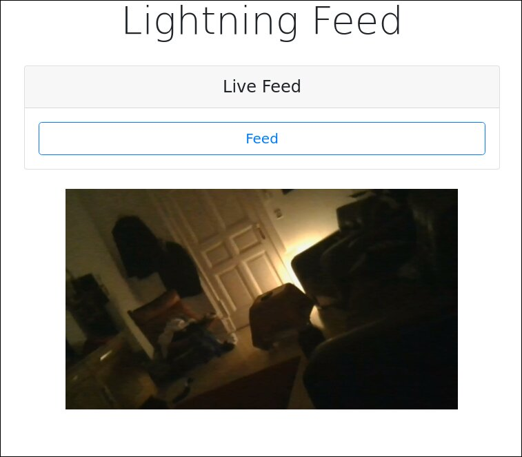

# lightningfood
lightning network enabled food dispenser

## Setup
```
$ pip install -r requirements.txt
$ python main.py
```

this will generate something like



## Building the gRPC/protobuf bindings (optional)

```bash
$ git clone https://github.com/googleapis/googleapis.git
$ python -m grpc_tools.protoc --proto_path=googleapis:. --python_out=. --grpc_python_out=. rpc.proto
$ rm -rf googleapis
```
